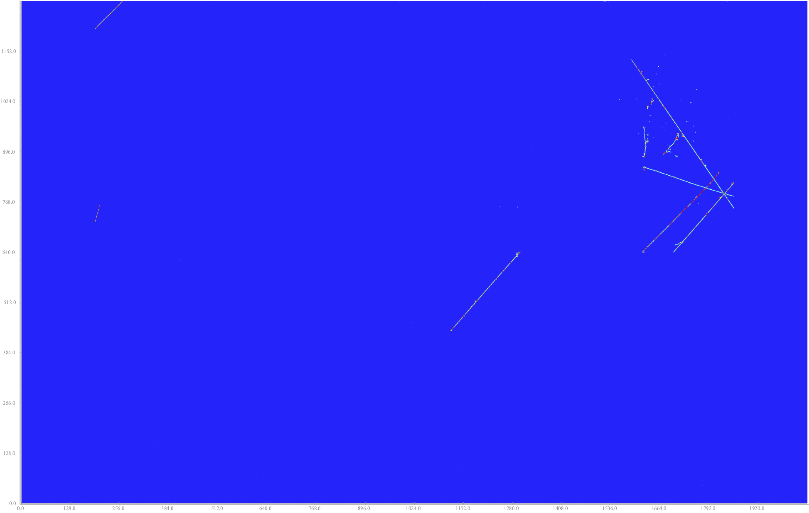
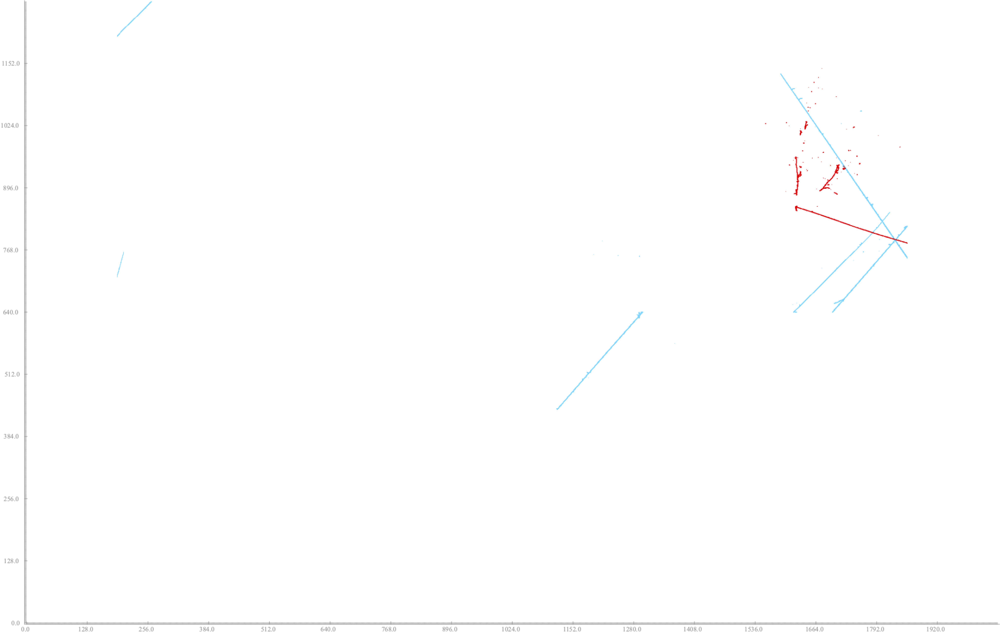
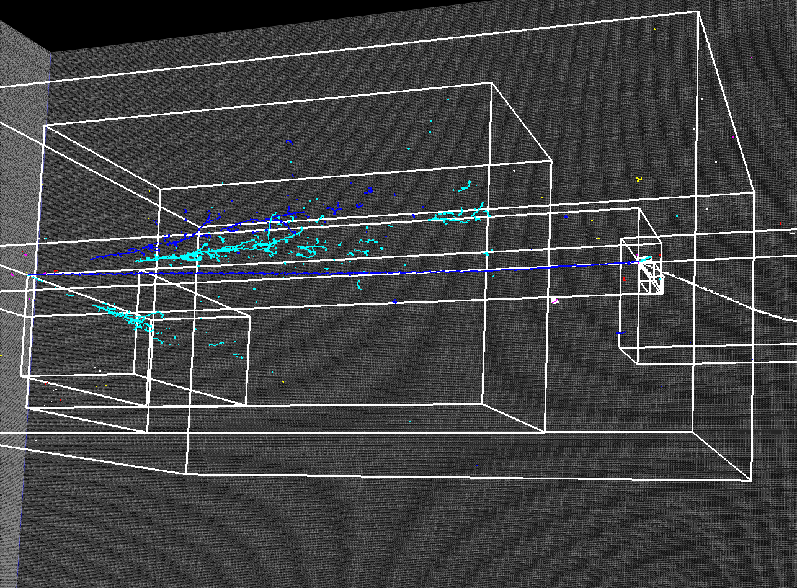

Data Model
##################

Here, we describe the data model driving the serialization and processing of `larcv`, and note some of it's history.  If and when new data products are added, we will add a description of them here and their motivation.

To enable efficient IO within `larcv`, we have designed a data model where users will format their data to fit into several abstract, optimized data products which can then be efficiently and automatically serialized or de-serialized.  With `HDF5`  as a backend for IO, we take advantage of the high performance, open-source and cross-platform file formats.  We build several data types on top of this to accommodate the unique needs of sparse, high energy physics data.  Additionally, `HDF5` enables `larcv` to handle sparse IO at scale with MPI-IO as needed.

Particle physics data is typically multi-channeled with several sources of data per single observed (or simulated) interaction.  The atomic unit of a particle physics data-set is often called an **event** and represents one self-contained observation (or simulation) of a detector.  An event can contain images from an imaging detector, segmentation labels from a simulation, and multiple projections of a single detector's readout.  Additionally, simulated events typically contain a list of *particle* objects representing the trajectories of fundamental particles, their energies, and their hierarchy of which particles created which other particles.  It is a fundamental design principle of `larcv` to enable efficient storage and use of these pieces.

The core data objects of `larcv` are as follows

* **Tensors (1D, 2D, 3D or 4D)** - A tensor is a dense, memory-contiguous object that can be interpreted as a multi-dimensional array.  For better integration into the Python ecosystem, the indexing scheme adopted by `larcv` to map from contiguous memory location to N-dimensional index is deliberately identical to the scheme used by `numpy`.  Once deserialized from disk, a Tensor in `larcv` can be yielded to `numpy` with zero data copy.  Examples of Tensor2D data are shown below.  

A dense tensor data:

* **SparseTensor (2D or 3D)** - A sparse tensor is a zero-suppressed implementation of a Tensor object, where the key data encoded is a `Voxel` object consisting of a (value, index) pair.  The index represents the index of this voxel if it were stored in a contiguous-memory tensor, while the value is self-explanatory. Sparse tensors are zero-suppressed in concept, but it is permissible to deliberately store a 0.0 value if that is needed by an application.  SparseTensors can represent the intrinsic data of an experiment, or derived objects such as sparse segmentation masks.

And, the sparse tensor segmentation labels for the above image:

* **SparseCluster (2D or 3D)** - A sparse cluster is an extension of a sparse tensor where each voxel is effectively given a third property, an index of a `cluster` to which it belongs.  In particular, this is targeting instance segmentation tasks where multiple masks are part of the labeled data set for any given image.

Examples of sparse clusters can be seen below in 3D.

* **Particle** - A particle represents high-level simulated or reconstructed information about an Event as a whole, or a list of particles can represent the detailed information about every particle tracked in an event.  Particle objects contain, for example, energy, vertex, and momentum information.  They also may be used for entire-event classification storage.  Particles can store hierarchy information, and can also be used to create hierarchies of associated objects (SparseClusters, Bounding Boxes).

* **Bounding Box  (2D or 3D)** - A rectangular object that dictates the extent of an object of interest in a detector.  Similar to the bounding boxes of object detection work in computer vision \cite{faster-rcnn}, though extended with rotation matrices to enable a broad suite of use cases (lines, rectangles, at angles, etc.).  Bounding box example data is show in Figures~\ref{fig:dune2d_data} and \ref{fig:dune3d_data}.

Shown here are 3D SparseCluster objects as well as bounding boxes:

* **ImageMeta (1D, 2D, 3D or 4D)** - A meta class describes the voxelization of an N-dimensional space, including the location of the origin, size, and number of voxels per dimension.  While not a dataproduct in and of itself, the ImageMeta class provides the context for the spatial dataproducts and therefore also defines how they interact.

With the exception of the Particle data product, each of the data products has an associated vector of "projection IDs" which can serve as a multipurpose enumeration of detectors: it can be the multiple wire-planes of a LArTPC, or several readout regions in a segmented detector.  It is up the creator of the data to decide.  To describe the properties of the volume indicated by the projection ID, an ImageMeta object is stored with each projection that describes the physical volume in terms of number of voxels, voxel size, and origin across all dimensions.  

The ImageMeta objects also provide a convenient interface for raveling/unraveling a multi-dimension index, identical to the ``numpy`` scheme of mapping a multi-index to a single flattened array index.  The ImageMeta interface is shared across all data products that have a spatial relation, ensuring consistent development patterns.  The ImageMeta objects also provide the absolute positioning of all objects, enabling full images to be built from objects that represent only a subset of a detector, potentially.
