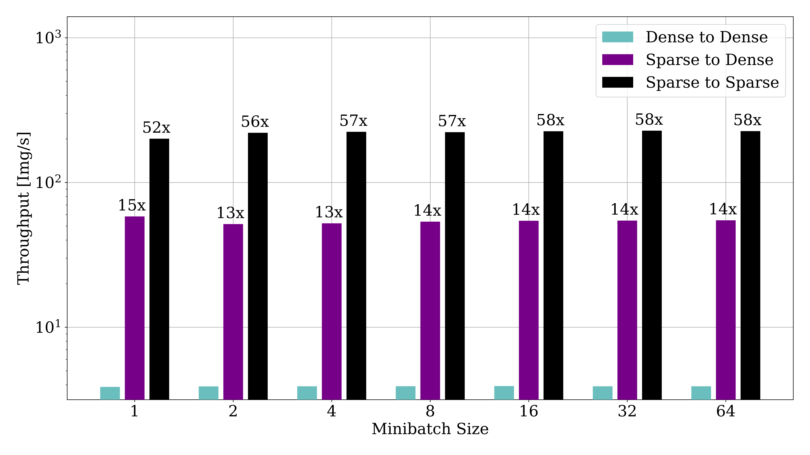

Performance
##############

``larcv`` is designed for performance from the start, but in particular readback performance to keep high performance accelerators from stalling out in your workloads.  Most serialization and deserialization algorithms are optimized for good performance, and the data structures are also meant to be generally fast, too.

The best way to get good performance at read-back time is to use the QueueIO interface.  Check out the Quick Start guide for guidance on how to use it.

Data Types Matter
-------------------

If you have the option to read your data as sparse data, this is generally much faster than reading it as dense data.  Why?  It's less IO bandwidth and therefore less IO time, even though there is some additional overhead required to read the sparse IO formats.

Additionally, if you are using the Queue IO techniques, the output data makes a difference too.  Some techniques, like Graph networks or `Submanifold Sparse Convolutional Networks <https://github.com/facebookresearch/SparseConvNet>`_, directly can use the sparse data from your dataset without needing to unpack it into a full image first.  ``larcv`` supports this, and in fact the performance speed up is notable:

Shown here is the throughput, in Img/S, of the QueueIO technique as a function of minibatch size.  The three configurations represent:

* **Dense to Dense** - Data is stored in a dense format on disk, read into a dense array in memory and made available in python as a dense numpy array.

* **Sparse to Dense** - Data is stored in a sparse format on disk, but deliverd as a dense array in python.

* **Sparse to Sparse** - Data is stored in a sparse format on disk, and delivered as a 0-padded sparse array to python.

In this case, a significant speedup is acheive using sparse format on disk (reduction of IO), as well as sparse format in memory (Reduction of memory allocation and movement).  The results seen in your applications will vary, of course, depending on the hardware capabilities and the sparsity of the dataset.