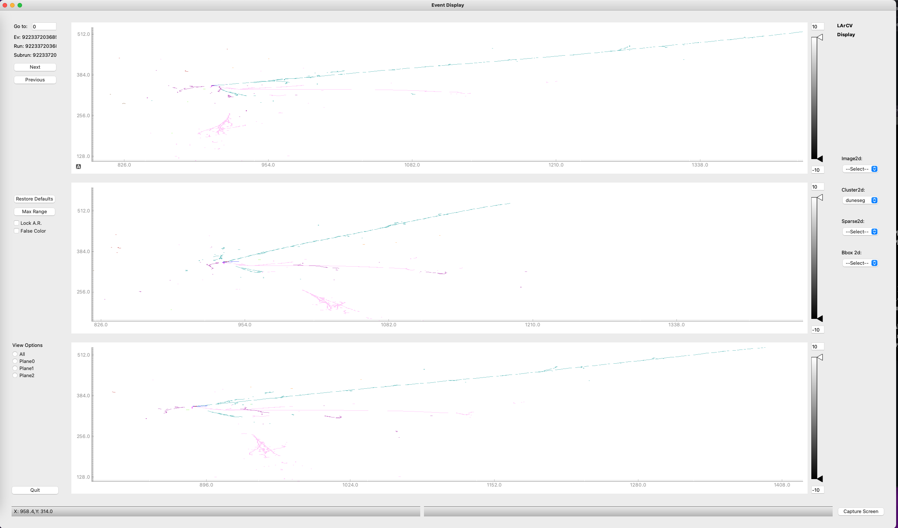
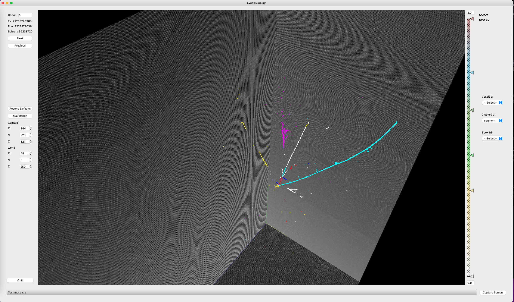

Visualization
####################

Visualizing sparse data can be challenging.  ``larcv`` has a viewer available as well, ``larcv-viewer``.  Because it has additional graphical requirements, we keep this component separate so that no one ends up in a situation where they need PyQT on a computing cluster when they don't care at all about a graphics viewer.

The viewer is a great tool, in particular, for debugging your datasets.  Any configurations that you want to use for Preprocessing are also available in the viewer.  The viewer provides two executable scripts, ``view-larcv.py`` and ``view3D-larcv.py`` that present the 2D and 3D data, respsectively.  You can run either script with a syntax like so:

>>> view-larcv.py [-c optional_config.cfg] file1.h5 [file2.h5 ...]

The Viewers will automatically detect the dimensions of the data space in the file by using the ImageMeta dataproducts from objects in the file; if your file doesn't have these objects, the viewer will not work.

When you run the 2D viewer, you ought to see images something like this:

And, for the 3D viewer, the GUI looks something like this:

